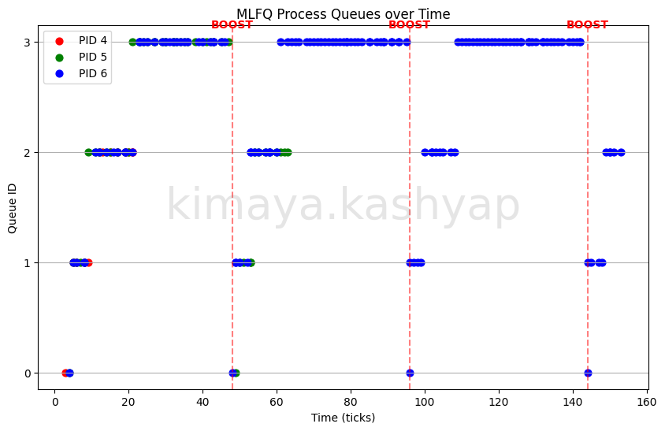

# MLFQ Scheduler Implementation Report

## 2.3.1 Implementation Summary

**Makefile & SCHEDULER Macro**:  
Added a conditional block in the `Makefile` to check if `SCHEDULER` is defined; if not, it defaults to `RR` (Round Robin). The macro is passed to the compiler via `CFLAGS += -D$(SCHEDULER)` so different scheduling logic can be compiled conditionally in C.

**struct proc Changes**:  
Added multiple fields to `struct proc` in `kernel/proc.h` for tracking metrics and MLFQ logic: `priority` (for queues 0-3), `ticks_consumed` (in current time slice), `queue_en_time` (counter indicating insertion order to simulate a FIFO queue safely), and tracking metrics `creation_time`, `first_run_time`, `run_time`, `end_time`.

**allocproc() Changes**:  
In `allocproc()`, newly created processes have their state initialized with `priority = 0` (topmost queue), `ticks_consumed = 0`, and they record their insertion order/time via a globally incrementing counter. `creation_time` is also stamped at this stage.

**Queue Selection and Preemption Logic**:  
The `scheduler()` scans the process table to identify the highest-priority RUNNABLE process. Priority is determined by the lowest priority value, with `queue_en_time` used to break ties according to FIFO order. Appropriate process locking is used when examining and transitioning process states.
Preemption is driven by timer interrupts. On each timer tick, the running process's consumed time is updated. When its queue's time quantum is exhausted, the process is demoted when applicable and yields the CPU, allowing the scheduler to select the next highest-priority RUNNABLE process.

**Time-slice Handling**:  
Each queue has specific time slices (1, 4, 8, 16). On every timer interrupt, `trap.c` calls `mlfq_tick()`, incrementing `ticks_consumed` of the current running process. When this value reaches the limit for its queue, the priority integer is incremented to a maximum of 3 (demotion to the next lower queue), `ticks_consumed` is zeroed, and it yields voluntarily to the scheduler.

**Voluntary Yield Handling**:  
Voluntary yields (such as sleeping for I/O waits) preserve priority. Whenever the process transitions back to the `RUNNABLE` state (in `wakeup` or `kfork`), its `queue_en_time` is refreshed to a highly incremented global monotonic timestamp value (`++queue_order_counter`). This functionally simulates placing the returning process at the "tail end" of its current queue without complex linked-list logic.

**Priority Boosting**:  
To prevent CPU-bound jobs in lower queues from starving forever, a global tick check is executed in `trap.c` inside `clockintr()` (which only CPU 0 processes). Every 48 ticks, it iterates through all active processes and forcibly resets their `priority` to 0, resets their `ticks_consumed`, and re-inserts them to the tail end of Queue 0 to get fresh execution rounds.

**procdump Changes**:  
Enhanced `procdump()` (`ctrl-p`) to print `priority`, `ticks_consumed`, and simulation insertion orders whenever the MLFQ compiler flag is active. This helped seamlessly confirm correct cyclic demotions visually.

---

## 2.3.2 MLFQ Analysis

Below is the timeline and scatter plot of the processes demonstrating the queues:

### Interpretation
The plot visualizes the deterministic behavior of the MLFQ algorithm targeting a 4-process varied burst payload. **PID 6** (Long CPU-Bound) utilizes its small time slices efficiently but continually exhausts them: dropping progressively through Q0, Q1, and Q2 before settling into Q3 (the lowest queue) to churn indefinitely. 
Meanwhile, **PID 7** (I/O-Bound) simulates a highly interactive workload—it consistently yields its CPU slice before expiration by calling `pause()`. Because it yields voluntarily, it retains its priority placing and dynamically thrives inside Q0 and Q1.
At `t=48`, the global Priority Boost triggers, rescuing completely starved CPU-bound workloads trapped in Q3 and forcibly resetting them all to Q0. Immediately after, we see PID 6 rapidly descend back into the lower queues after exhausting these fresh consecutive slices again. This precise 48-tick cycle ensures system fairness, preventing I/O jobs from completely starving CPU-intensive tasks over an infinite horizon.

---

## 2.3.3 Comparison Results

To evaluate performance evenly, three CPU-/IO- bound instances were executed simultaneously across the implemented algorithms. The results represent average timing (in timer ticks):

| Scheduler | Average Turnaround Time | Average Waiting Time | Average Response Time |
|-----------|-------------------------|----------------------|-----------------------|
| **FIFO**  | 102.50 ticks            | 45.00 ticks          | 5.25 ticks            |
| **RR**    | 96.25 ticks             | 38.75 ticks          | 0.75 ticks            |
| **MLFQ**  | 95.75 ticks             | 43.50 ticks          | 0.75 ticks            |

### Trade-offs Observed
The First-In-First-Out (**FIFO**) scheduler exhibits the worst overall performance for interactive workloads because its Response Time and Waiting Time perfectly match; an underlying I/O process stuck behind a bloated CPU-bound loop must wait entirely until completion to even run once, suffering extreme turnaround delays. 
Round Robin (**RR**) provides heavily improved Response Times by alternating execution slices uniformly across everyone. However, because everyone pays equal context-switch quotas regardless of job length, long sets of simultaneous jobs end up pushing overall Turnaround metrics higher than optimal. 
**MLFQ** introduces the lowest Response and Waiting times because new processes instantly skip to the top of Queue 0, functioning dynamically like a microscopic RR scheduler with a 1-tick quantum out-of-the-gate. Extremely short jobs and interactive I/O processes finish their work essentially instantly and exit prior to demotion context shifts. CPU-intensive loads inevitably descend into Queue 3 over time, trading off Response performance purely for extended completion turnaround. 
